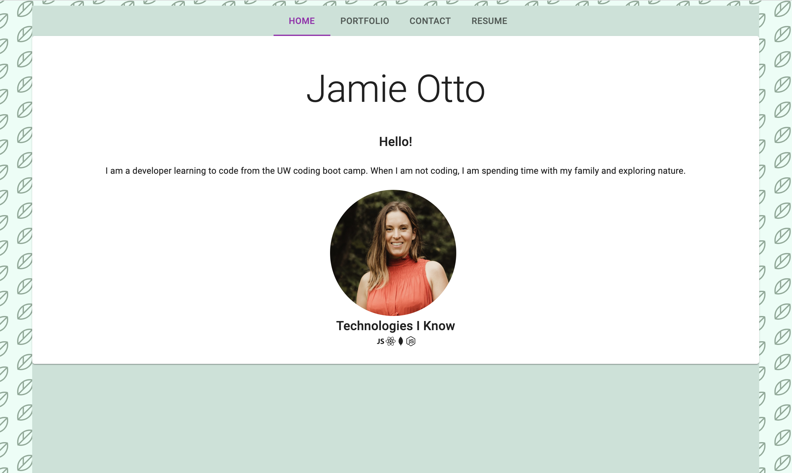

# React Portfolio - Jamie Otto

[Deployed Portfolio](https://jmotto.github.io/jamie-otto/)

## Description

This portfolio was created using React and deployed using GitHub pages. Material UI components were used to style. 

## Table of Contents

- [Installation](#installation)
- [Usage](#usage)
- [License](#license)
- [Tests](#tests)
- [Questions](#questions)

## Installation
To install the necessary dependencies for this application, open up the terminal at the root then run `npm install`.
### `npm start`

Runs the app in the development mode.\
Open [http://localhost:3000](http://localhost:3000) to view it in your browser.

## Usage
To deploy the text editor, follow this [link](https://jmotto.github.io/jamie-otto/). 

Here is a screenshot of the homepage of my portfolio.

## License
This application is licensed under [MIT]((https://opensource.org/licenses/MIT)). 
  Copyright &copy; 2022 Jamie Otto

## Tests
Tests are not required.
## Questions
If you have any questions about this project, please contact [jmotto31@gmail.com](mailto:jmotto31@gmail.com). To view more of my projects, go to [jmotto](https://github.com/jmotto).
